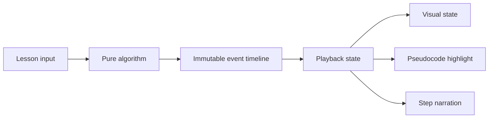

# Cartesian — Interactive Algorithm Handbook

An interactive, visual learning environment for understanding data structures and algorithms through animated execution, synchronized pseudocode, and step-by-step reasoning.

> **Project status:** Active development. The application currently includes the complete handbook shell and three production-quality sorting lessons backed by a shared visualization player.


## Why Cartesian exists

Algorithm material often explains the final code without showing the decisions that happen while it runs. Cartesian is designed around a different learning loop:

1. See the mental model.
2. Control the execution.
3. Connect each state change to the relevant pseudocode.
4. Explain why the step is valid.
5. Practice predicting what happens next.

The goal is not to make algorithms merely look animated. The goal is to make their reasoning inspectable.

## Current experience

- Responsive, book-inspired learning interface
- Chapter navigation and progress presentation
- Keyboard-accessible navigation drawer (`M` to toggle, `Escape` to close)
- Interactive Bubble Sort, Selection Sort, and Insertion Sort lessons
- Play, pause, replay, previous-step, and next-step controls
- Three playback speeds
- Random input generation
- Synchronized pseudocode highlighting
- Step-specific explanations and pass tracking
- Direct lesson links for each implemented algorithm
- Reduced-motion support


<details>
<summary>Mobile experience</summary>

| Learning path | Bubble Sort lesson |
| --- | --- |
|  |  |

</details>

## Architecture

Cartesian separates algorithm execution from rendering. An algorithm produces immutable semantic events; the player decides when to reveal them; React renders the selected event.



Both sorting algorithms emit snapshots with the same semantic contract:

```ts
type SortStep = {
  values: number[]
  compared: [number, number] | null
  swapped: [number, number] | null
  sortedIndices: number[]
  line: number
  pass: number
  title: string
  explanation: string
}
```

This boundary keeps the algorithm testable without a browser and allows the UI to pause, replay, or seek without re-running partially mutated logic. See [Architecture](docs/ARCHITECTURE.md) for the detailed design and trade-offs.

## Technology

- React 19
- TypeScript 6
- Vite 8
- Vitest
- Oxlint
- CSS animations and responsive layout

No visualization or animation library is currently required. That is intentional: the current sorting interactions remain small enough for browser-native transitions, and a dependency should only be introduced when it solves a demonstrated orchestration problem.

## Getting started

### Prerequisites

- Node.js 22 or newer
- npm 10 or newer

### Installation

```bash
git clone git@github.com:moslemajra85/cartesian-interactive-algorithms.git
cd cartesian-interactive-algorithms
npm install
npm run dev
```

Vite prints the local development URL after startup.

Open either implemented lesson directly at:

```text
http://localhost:5173/#bubble-sort
http://localhost:5173/#selection-sort
http://localhost:5173/#insertion-sort
```

## Available commands

| Command | Purpose |
| --- | --- |
| `npm run dev` | Start the development server with hot reload |
| `npm test` | Run the unit test suite once |
| `npm run lint` | Run static analysis with Oxlint |
| `npm run build` | Type-check and create a production build |
| `npm run preview` | Preview the production build locally |

## Project structure

```text
cartesian-interactive-algorithms/
├── docs/
│   ├── images/                 # Verified product screenshots
│   ├── ARCHITECTURE.md         # System boundaries and design decisions
│   └── CONTRIBUTING.md         # Development workflow
├── src/
│   ├── features/
│   │   └── sorting/
│   │       ├── BubbleSortLesson.tsx
│   │       ├── InsertionSortLesson.tsx
│   │       ├── SelectionSortLesson.tsx
│   │       ├── SortLesson.tsx
│   │       ├── sortStep.ts
│   │       ├── bubbleSort.ts
│   │       ├── bubbleSort.test.ts
│   │       ├── insertionSort.ts
│   │       ├── insertionSort.test.ts
│   │       ├── selectionSort.ts
│   │       └── selectionSort.test.ts
│   ├── App.tsx                 # Handbook shell and screen navigation
│   ├── App.css                 # Product and lesson styling
│   ├── index.css               # Global tokens and defaults
│   └── main.tsx                # React entry point
├── index.html
├── package.json
└── vite.config.ts
```

## Testing strategy

The current tests target the pure event generator because it carries the correctness risk. They verify:

- Correct final ordering
- Input immutability
- Duplicate preservation
- Early exit for already sorted input
- Empty and singleton inputs
- Adjacent-only swap events
- Complete sorted-index metadata

The second lesson justified extracting a shared sorting player. Component interaction tests are now the next useful layer for protecting playback, navigation, and keyboard behavior.

## Roadmap

### Foundation

- [x] Interactive handbook shell
- [x] Responsive chapter navigation
- [x] Event-driven animation model
- [x] Bubble Sort vertical slice
- [x] Selection Sort lesson and shared sorting player
- [x] Insertion Sort lesson
- [x] Algorithm unit tests
- [ ] Continuous integration
- [ ] Static deployment

### Learning experience

- [ ] Prediction checkpoints
- [ ] Lesson completion and local progress persistence
- [ ] Accessible keyboard playback controls
- [ ] Lesson catalogue and routing
- [ ] User-provided visualization inputs

### Curriculum

- [ ] Merge Sort
- [ ] Binary Search
- [ ] Linked lists, stacks, and queues
- [ ] Tree traversal
- [ ] Graph traversal and shortest paths
- [ ] Problem-solving pattern lessons

## Engineering principles

- Prefer semantic algorithm events over UI-specific commands.
- Keep lesson logic deterministic and independently testable.
- Introduce shared abstractions only after a second real use case appears.
- Preserve keyboard access and reduced-motion behavior.
- Commit completed, verified milestones—not partially working states.

## Contributing

This project is under active development. Read [CONTRIBUTING.md](docs/CONTRIBUTING.md) before opening a change.

## Attribution and assets

Cartesian is a clean web implementation inspired by the experience of interactive algorithm handbooks. Its interface, code, and geometric artwork are original. Third-party application assets are not copied into this repository.

## License

No open-source license has been selected yet. Until one is added, the source remains available for viewing but is not granted an open-source usage license.
