# Cartesian — Interactive Algorithm Handbook

An interactive, visual learning environment for understanding data structures and algorithms through animated execution, synchronized pseudocode, and step-by-step reasoning.

> **Project status:** Active development. The application currently includes the complete six-lesson Foundations chapter, five Arrays & Sorting lessons, and five interactive Linked Structures lessons.

[](https://github.com/moslemajra85/cartesian-interactive-algorithms/actions/workflows/ci-and-deploy.yml)
[](https://moslemajra85.github.io/cartesian-interactive-algorithms/)

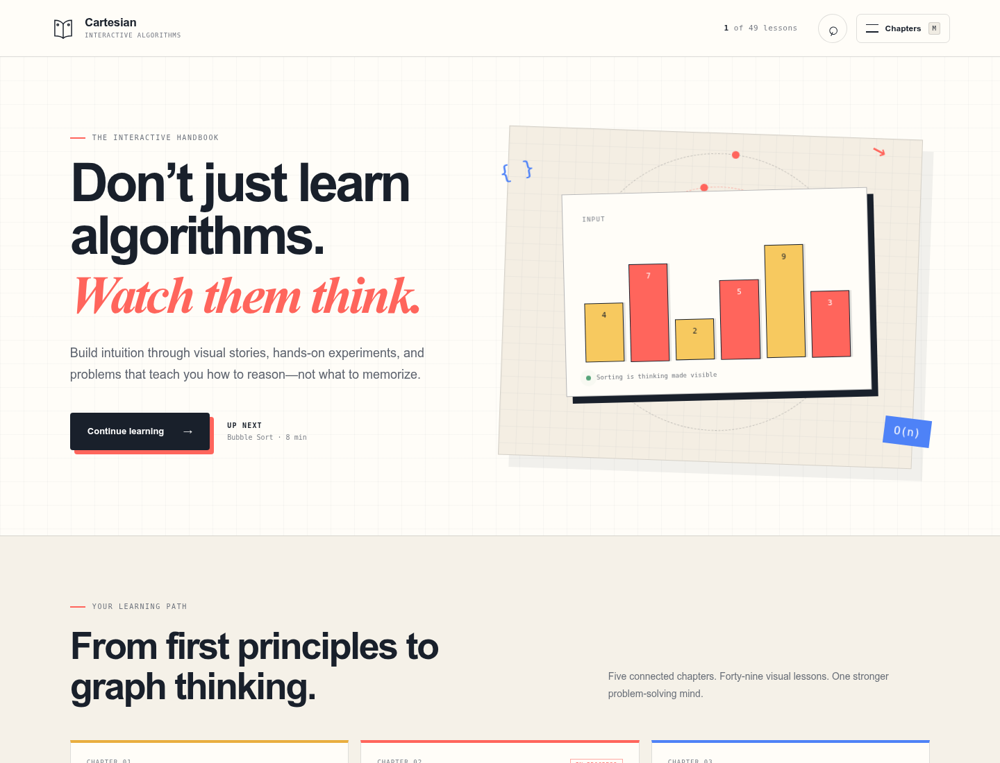

## Why Cartesian exists

Algorithm material often explains the final code without showing the decisions that happen while it runs. Cartesian is designed around a different learning loop:

1. See the mental model.
2. Control the execution.
3. Connect each state change to the relevant pseudocode.
4. Explain why the step is valid.
5. Practice predicting what happens next.

The goal is not to make algorithms merely look animated. The goal is to make their reasoning inspectable.

## Current experience

- Responsive, book-inspired learning interface
- Chapter navigation and progress presentation
- Interactive Foundations chapter introduction comparing constant through quadratic growth
- Direct input-size experiments with sliders and precise increment/decrement controls
- Concrete problem briefs with actors, operational constraints, and an engineering decision in every lesson
- Operation-counting lesson that distinguishes sequential addition from nested multiplication
- Auxiliary-space lesson contrasting fixed in-place workspace with input-sized copying
- Best/average/worst-case lesson that separates observed runs from upper-bound guarantees
- Recursion lesson with adjustable depth and visible call-stack descent and unwinding
- Time–space trade-off lab comparing repeated scans with a reusable index
- Learner-configurable linked-list operations with stable node identities and animated `predecessor`, `new`, `target`, `successor`, and `current` pointers
- Learner-configurable linked-list deletion with explicit bypass, detachment, release phases, and visible reference-write expressions
- Linked traversal lab with present and missing targets and visible next-reference movement
- Interactive linked-stack push/pop lab with animated `top`, `new`, and `oldTop` references, including empty-stack semantics
- Interactive linked-queue enqueue/dequeue lab with animated `front`, `rear`, `new`, and `oldFront` references and explicit empty-boundary repair
- Typed lesson catalogue with a dedicated Arrays & Sorting chapter screen
- Keyboard-accessible lesson search derived from the typed curriculum registry
- Keyboard-accessible navigation drawer (`M` to toggle, `Escape` to close)
- Interactive Bubble Sort, Selection Sort, Insertion Sort, Merge Sort, and Binary Search lessons
- Play, pause, replay, previous-step, and next-step controls
- Keyboard playback controls with visible shortcut guidance
- Three playback speeds
- Random input generation
- User-defined arrays with inline validation and duplicate-value support
- Dual array representation with indexed memory cells and magnitude bars
- Directional swap motion, staggered merge settling, candidate-range elimination, midpoint focus, and animated step narration
- Spring-based linked-node layout transitions, animated rewiring, detachment, and exit choreography
- Synchronized pseudocode highlighting
- Step-specific explanations and pass tracking
- Direct lesson links for each implemented algorithm
- Browser back/forward support, route-specific titles, and an explicit not-found state
- Versioned local progress, completion marks, resume behavior, and reset controls
- Algorithm-specific prediction checkpoints with retryable hints and invariant explanations
- Reduced-motion support

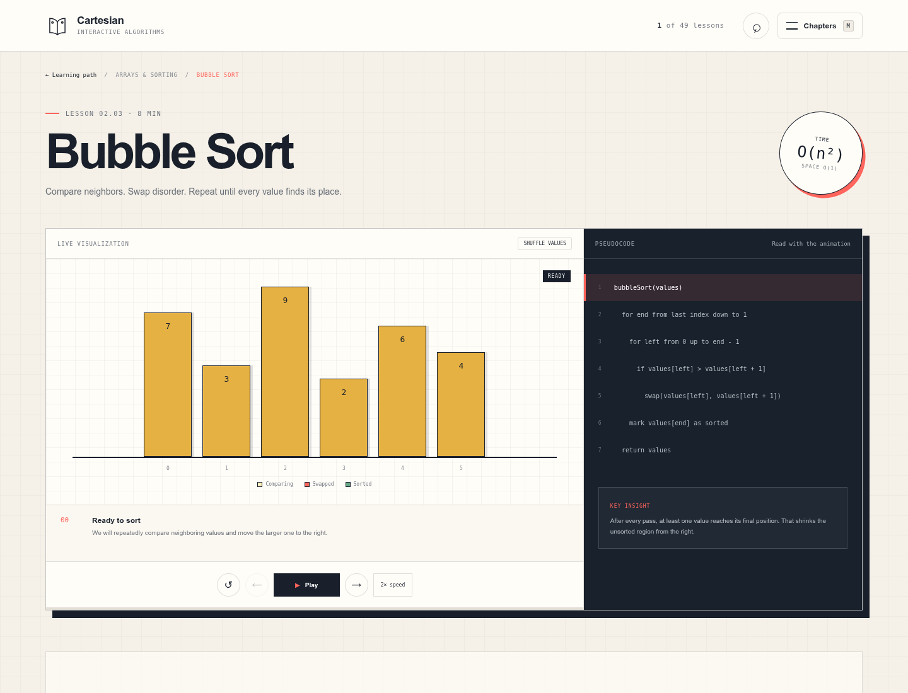

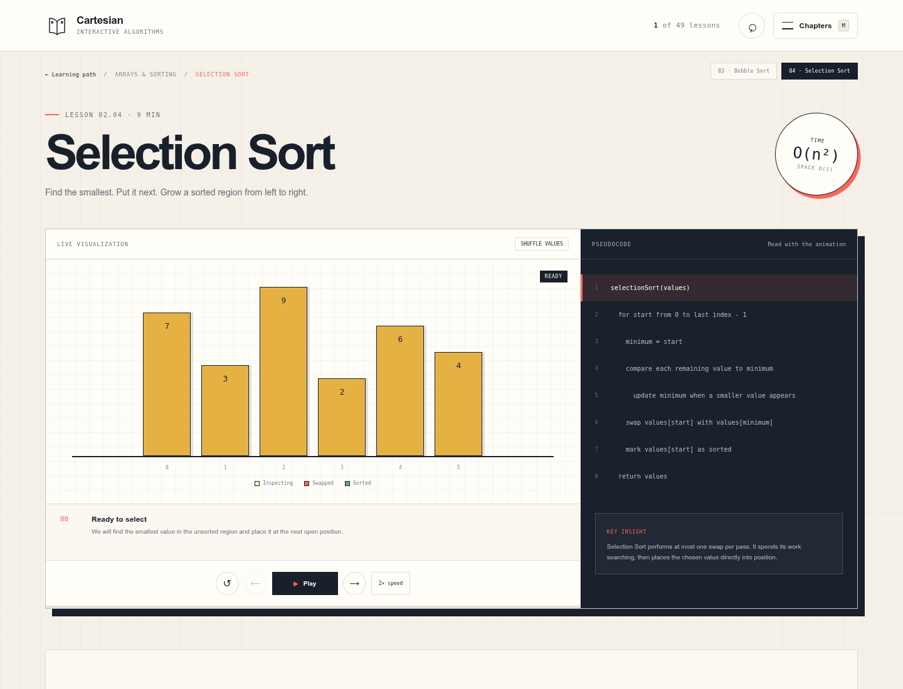

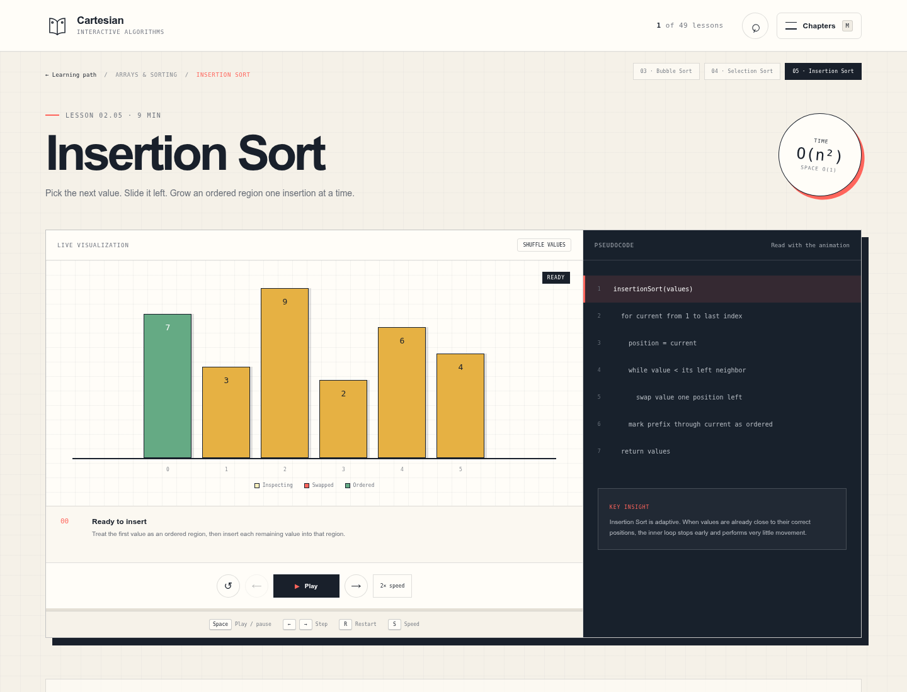

<details>
<summary>Recursive Merge Sort lesson</summary>

Merge Sort adds semantic split boundaries, active recursive ranges, cross-half comparisons, and committed merged ranges. The memory tape keeps indices visible while staggered bars show the merge settling into place—without coupling the algorithm to pixel positions.

| Desktop | Mobile |
| --- | --- |
| 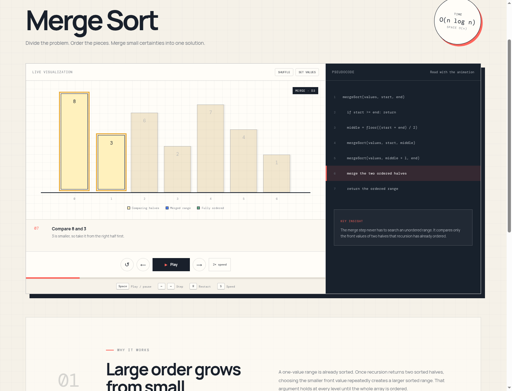 | 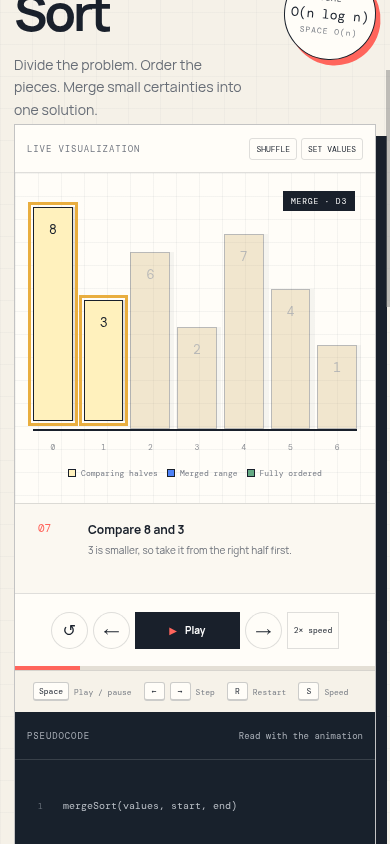 |

</details>

<details>
<summary>Binary Search lesson</summary>

Binary Search makes its sorted-input precondition visible. Each midpoint check highlights one candidate, then the eliminated half recedes while stable indices remain readable. Learner-provided values are validated and sorted before a new timeline is generated; the pure algorithm rejects unordered input rather than silently teaching invalid behavior.

| Desktop | Mobile |
| --- | --- |
| 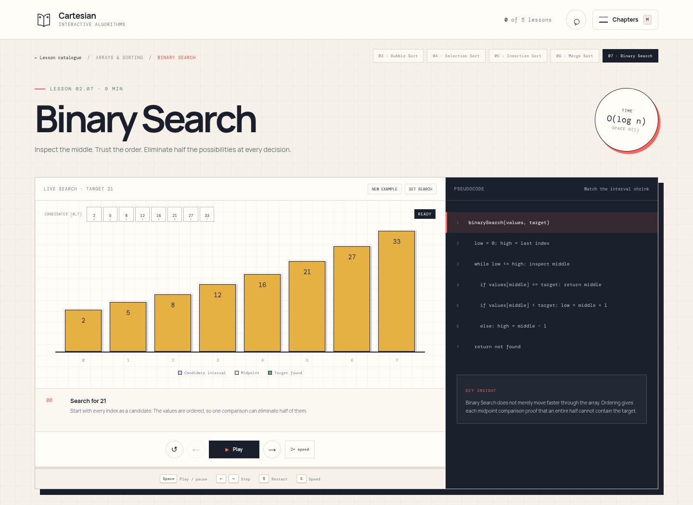 | 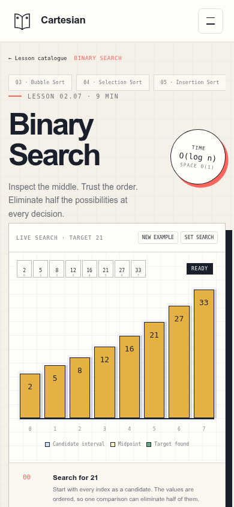 |

</details>

<details>
<summary>Mobile experience</summary>

| Learning path | Bubble Sort lesson |
| --- | --- |
|  | 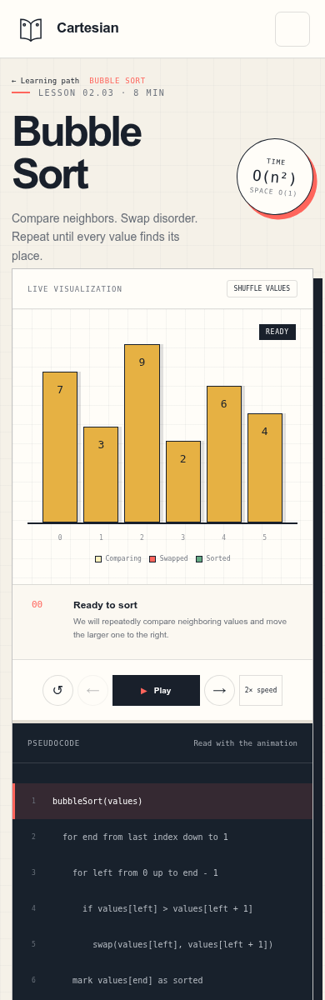 |

</details>

<details>
<summary>Lesson catalogue and routing</summary>

Chapter navigation now opens a progress-aware catalogue derived from the same typed registry used by routing, lesson switching, and persistence validation.

| Desktop | Mobile |
| --- | --- |
| 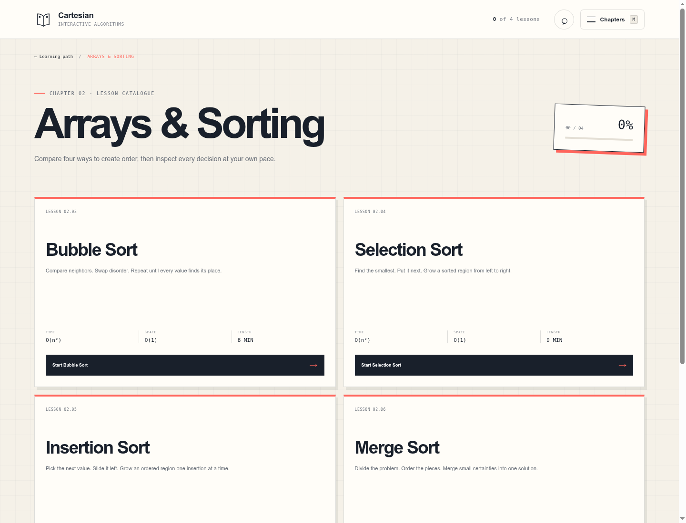 | 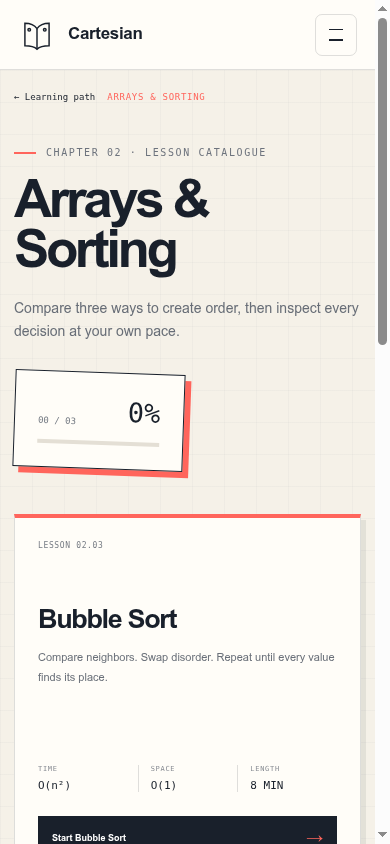 |

</details>

<details>
<summary>Custom visualization inputs</summary>

Learners can run every sorting lesson against 2–8 whole numbers from 1–99. The shared editor accepts commas or spaces, explains invalid input inline, and preserves duplicate values.

| Desktop | Mobile |
| --- | --- |
| 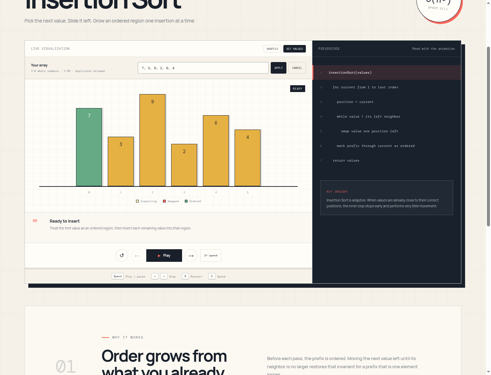 | 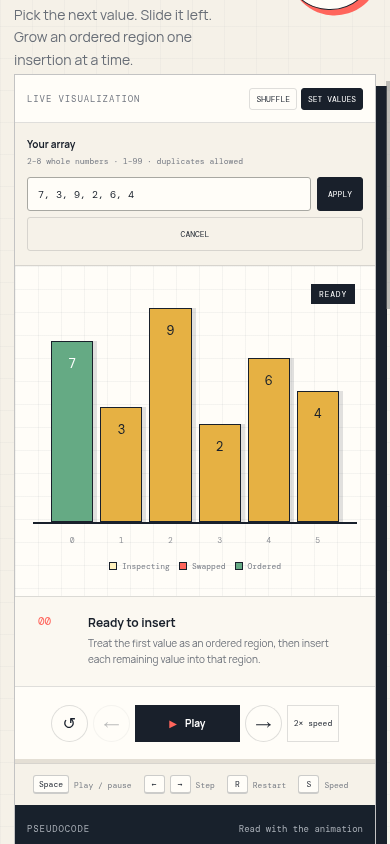 |

</details>

<details>
<summary>Prediction checkpoint</summary>

Each implemented lesson ends with a reasoning question tied to the algorithm's invariant—not syntax recall.

| Desktop | Mobile |
| --- | --- |
| 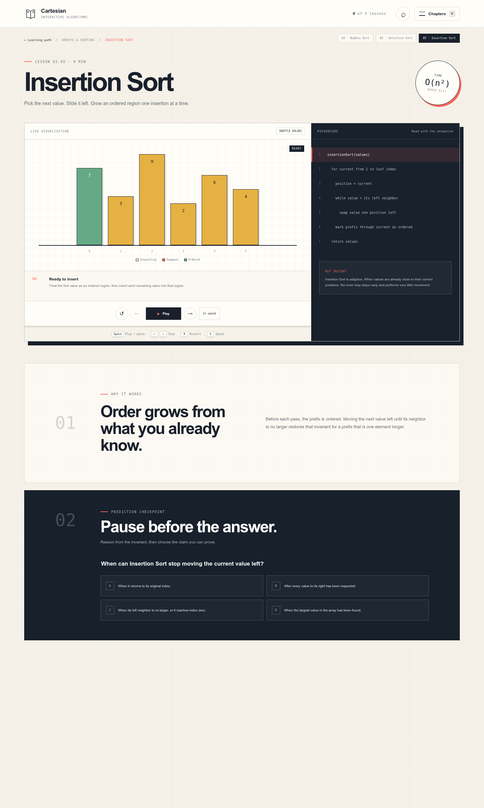 | 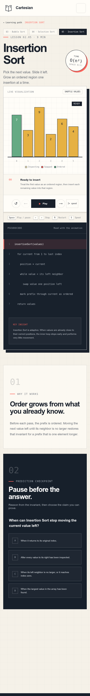 |

</details>

<details>
<summary>Restored learning progress</summary>

Progress is restored on refresh without an account. Percentages are derived from completed lessons rather than stored separately.

| Desktop | Mobile |
| --- | --- |
| 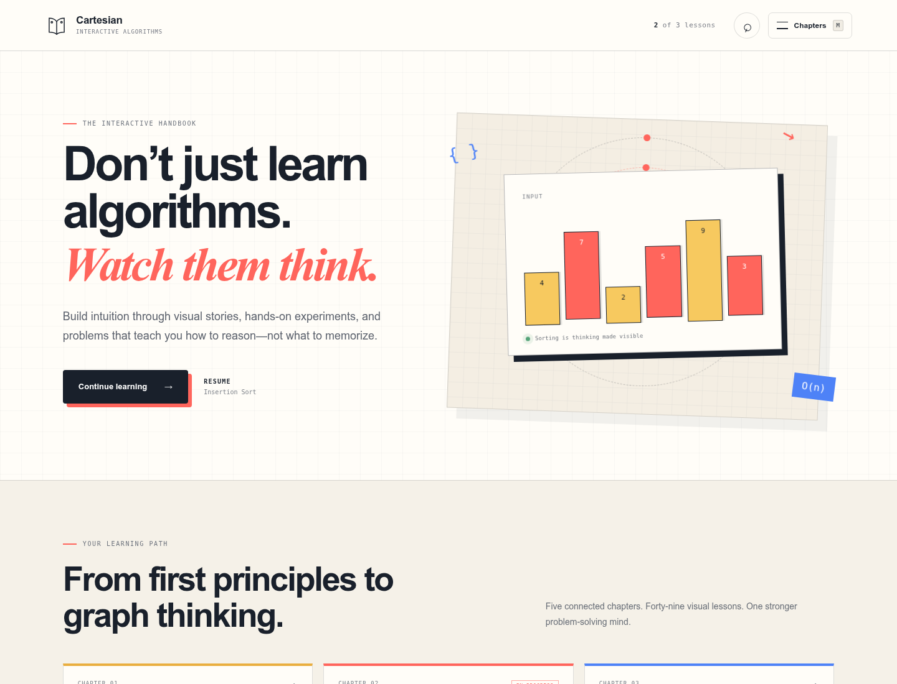 | 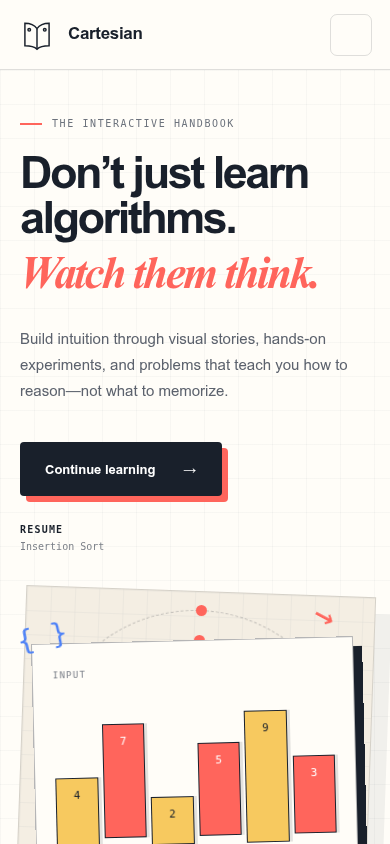 |

</details>

## Architecture

Cartesian separates algorithm execution from rendering. An algorithm produces immutable semantic events; the player decides when to reveal them; React renders the selected event.

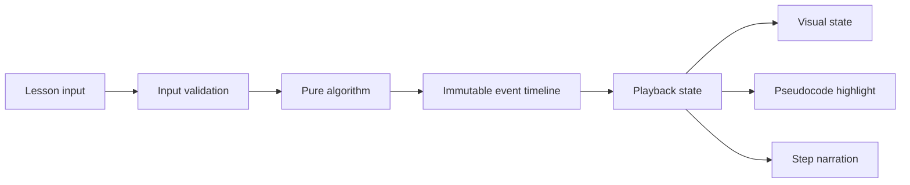

All sorting algorithms emit snapshots with the same semantic contract:

```ts
type SortStep = {
  values: number[]
  compared: [number, number] | null
  swapped: [number, number] | null
  sortedIndices: number[]
  line: number
  pass: number
  title: string
  explanation: string
  activeRange?: [number, number] | null
  splitAt?: number | null
  mergedRange?: [number, number] | null
  phaseLabel?: string
}
```

This boundary keeps the algorithm testable without a browser and allows the UI to pause, replay, or seek without re-running partially mutated logic. See [Architecture](docs/ARCHITECTURE.md) for the detailed design and trade-offs.

## Technology

- React 19
- TypeScript 6
- Vite 8
- Vitest
- Testing Library and user-event
- jsdom for component interaction tests
- Oxlint
- CSS animations and responsive layout
- Motion for React for interruptible node layout and SVG-ready pointer choreography

Semantic event metadata drives every transition. CSS remains responsible for simple emphasis, swap travel, merge settling, and responsive presentation. Motion for React is scoped to linked structures, where stable nodes must move between layouts, survive exit transitions, and animate semantic pointer rewrites. Algorithm generators still emit no coordinates, easing, or duration values.

## Getting started

### Prerequisites

- Node.js 22 or newer
- npm 10 or newer

### Installation

```bash
git clone git@github.com:moslemajra85/cartesian-interactive-algorithms.git
cd cartesian-interactive-algorithms
npm install
npm run dev
```

Vite prints the local development URL after startup.

Open any implemented lesson directly at:

```text
http://localhost:5173/#arrays
http://localhost:5173/#foundations
http://localhost:5173/#complexity-growth
http://localhost:5173/#counting-operations
http://localhost:5173/#space-complexity
http://localhost:5173/#complexity-cases
http://localhost:5173/#recursion-stack
http://localhost:5173/#time-space-tradeoff
http://localhost:5173/#linked-lists
http://localhost:5173/#linked-insertion
http://localhost:5173/#linked-deletion
http://localhost:5173/#linked-traversal
http://localhost:5173/#stack-push-pop
http://localhost:5173/#queue-enqueue-dequeue
http://localhost:5173/#bubble-sort
http://localhost:5173/#selection-sort
http://localhost:5173/#insertion-sort
http://localhost:5173/#merge-sort
http://localhost:5173/#binary-search
```

## Deployment

The production site is available at [moslemajra85.github.io/cartesian-interactive-algorithms](https://moslemajra85.github.io/cartesian-interactive-algorithms/).

The `.github/workflows/ci-and-deploy.yml` workflow runs tests, lint, and a production build for pull requests and pushes to `main`. A successful `main` build is packaged and deployed through GitHub Pages. Pull requests receive read-only permissions and never deploy.

Vite uses `/` during local development and `/cartesian-interactive-algorithms/` for production builds. This distinction is required because the Pages site is hosted under a repository path. To inspect the exact production paths locally:

```bash
npm run build
npm run preview
```

## Available commands

| Command | Purpose |
| --- | --- |
| `npm run dev` | Start the development server with hot reload |
| `npm test` | Run the unit test suite once |
| `npm run lint` | Run static analysis with Oxlint |
| `npm run build` | Type-check and create a production build |
| `npm run preview` | Preview the production build locally |

## Lesson keyboard controls

| Key | Action |
| --- | --- |
| `Space` | Play or pause; replay from the start after completion |
| `←` | Pause and move to the previous event |
| `→` | Pause and move to the next event |
| `R` | Restart the current timeline |
| `S` | Cycle through playback speeds |

Global lesson shortcuts are disabled while a button, link, input, or editable element has focus. Browser and operating-system combinations such as `Ctrl+R`, `Cmd+S`, and `Alt+←` are not intercepted.

## Project structure

```text
cartesian-interactive-algorithms/
├── docs/
│   ├── images/                 # Verified product screenshots
│   ├── ARCHITECTURE.md         # System boundaries and design decisions
│   └── CONTRIBUTING.md         # Development workflow
├── src/
│   ├── features/
│   │   ├── catalog/
│   │   │   ├── curriculum.tsx
│   │   │   ├── LessonCatalogue.tsx
│   │   │   ├── NotFoundScreen.tsx
│   │   │   └── routing.ts
│   │   ├── learning/
│   │   │   ├── PredictionCheckpoint.tsx
│   │   │   ├── PredictionCheckpoint.test.tsx
│   │   │   └── useStepPlayback.ts
│   │   ├── progress/
│   │   │   ├── learningProgress.ts
│   │   │   └── learningProgress.test.ts
│   │   ├── searching/
│   │   │   ├── BinarySearchLesson.tsx
│   │   │   ├── SearchInputControls.tsx
│   │   │   ├── binarySearch.ts
│   │   │   └── binarySearch.test.ts
│   │   └── sorting/
│   │       ├── ArrayInputControls.tsx
│   │       ├── ArrayVisualizer.tsx
│   │       ├── BubbleSortLesson.tsx
│   │       ├── InsertionSortLesson.tsx
│   │       ├── MergeSortLesson.tsx
│   │       ├── SelectionSortLesson.tsx
│   │       ├── SortLesson.tsx
│   │       ├── arrayInput.ts
│   │       ├── lessonDefinitions.ts
│   │       ├── sortStep.ts
│   │       ├── bubbleSort.ts
│   │       ├── bubbleSort.test.ts
│   │       ├── insertionSort.ts
│   │       ├── insertionSort.test.ts
│   │       ├── mergeSort.ts
│   │       ├── mergeSort.test.ts
│   │       ├── playbackShortcuts.ts
│   │       ├── playbackShortcuts.test.ts
│   │       ├── selectionSort.ts
│   │       └── selectionSort.test.ts
│   ├── App.tsx                 # Handbook shell and screen navigation
│   ├── App.css                 # Product and lesson styling
│   ├── index.css               # Global tokens and defaults
│   └── main.tsx                # React entry point
├── .github/workflows/          # Quality gate and Pages deployment
├── index.html
├── package.json
└── vite.config.ts
```

## Testing strategy

Pure event-generator tests protect algorithm correctness. They verify:

- Correct final ordering
- Input immutability
- Duplicate preservation
- Early exit for already sorted input
- Empty and singleton inputs
- Adjacent-only swap events
- Complete sorted-index metadata
- Valid recursive splits, cross-half comparisons, and ordered merge-range snapshots
- Binary Search midpoint correctness, logarithmic bounds, interval shrinkage, found/not-found states, and sorted-input enforcement
- Keyboard-command mapping and modified-shortcut protection
- Progress schema validation, deduplication, storage failures, save, and reset behavior
- Custom-array parsing, normalization, size limits, value limits, and duplicate preservation
- Route parsing, serialization, document titles, unknown paths, and legacy direct links

Component tests exercise prediction attempts, retry behavior, sorting and search input flows, linked-node identity and pointer movement, catalogue navigation, browser history events, route focus, document titles, and not-found behavior. Registry tests protect route uniqueness, chapter availability, and lesson numbering. The current suite contains 201 passing tests.

## Roadmap

### Foundation

- [x] Interactive handbook shell
- [x] Responsive chapter navigation
- [x] Event-driven animation model
- [x] Bubble Sort vertical slice
- [x] Selection Sort lesson and shared sorting player
- [x] Insertion Sort lesson
- [x] Algorithm unit tests
- [x] Continuous integration
- [x] Static deployment

### Learning experience

- [x] Prediction checkpoints
- [x] Lesson completion and local progress persistence
- [x] Accessible keyboard playback controls
- [x] Lesson catalogue and routing
- [x] User-provided visualization inputs

### Curriculum

- [x] Merge Sort
- [x] Binary Search
- [x] Linked lists, stacks, and queues
- [ ] Tree traversal
- [ ] Graph traversal and shortest paths
- [ ] Problem-solving pattern lessons

## Engineering principles

- Prefer semantic algorithm events over UI-specific commands.
- Keep lesson logic deterministic and independently testable.
- Introduce shared abstractions only after a second real use case appears.
- Preserve keyboard access and reduced-motion behavior.
- Commit completed, verified milestones—not partially working states.

## Contributing

This project is under active development. Read [CONTRIBUTING.md](docs/CONTRIBUTING.md) before opening a change.

## Attribution and assets

Cartesian is a clean web implementation inspired by the experience of interactive algorithm handbooks. Its interface, code, and geometric artwork are original. Third-party application assets are not copied into this repository.

## License

No open-source license has been selected yet. Until one is added, the source remains available for viewing but is not granted an open-source usage license.
