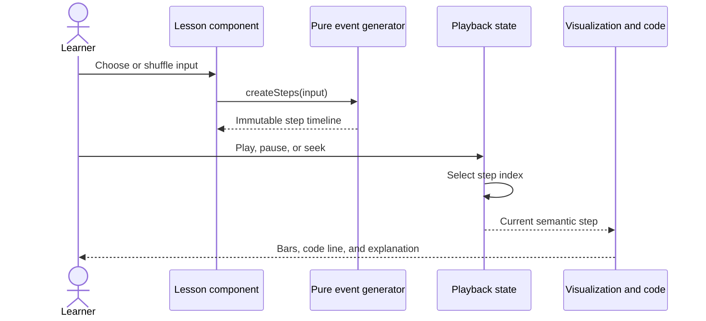
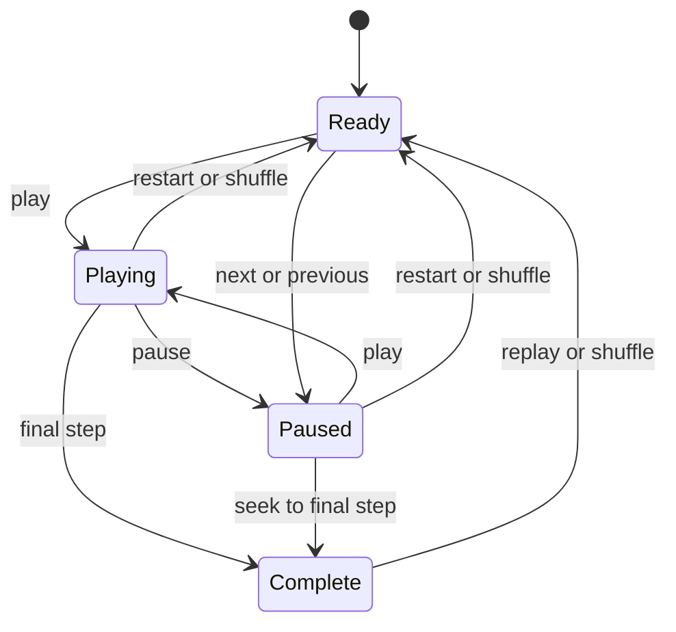

# Cartesian Architecture

This document explains the current runtime design, the boundaries that should remain stable, and the decisions intentionally deferred while the application grows beyond its first sorting lesson family.

## System goal

Cartesian turns algorithm execution into a timeline a learner can inspect. Each state must support:

- Deterministic replay
- Forward and backward stepping
- Synchronized visualization, code, and explanation
- Playback at different speeds
- Unit testing without rendering React

## Runtime flow

The arrows show ownership: the lesson owns the input, the algorithm owns event creation, the player owns time, and the view owns presentation.

## Responsibility boundaries

### Algorithm event generator

Locations: `src/features/sorting/bubbleSort.ts`, `src/features/sorting/selectionSort.ts`, and `src/features/sorting/insertionSort.ts`

Responsibilities:

- Accept plain input data
- Avoid mutating caller-owned values
- Execute the real algorithm
- Record meaningful semantic snapshots
- Return deterministic output

It must not import React, access the DOM, start timers, or choose colors.

### Shared sorting lesson player

Location: `src/features/sorting/SortLesson.tsx`

Responsibilities:

- Own the selected input and timeline cursor
- Schedule automatic playback
- Convert learner actions into cursor changes
- Render semantic event state
- Keep visualization, pseudocode, and narration synchronized

Bubble Sort, Selection Sort, and Insertion Sort provide typed lesson definitions and pure event generators to the shared player. The extraction happened only after Selection Sort demonstrated the common API: playback state, semantic bars, pseudocode highlighting, narration, speed controls, and lesson navigation.

The algorithm-specific wrapper components contain educational content rather than playback mechanics. This keeps lesson configuration explicit while preventing duplicated visualization code.

### Application shell

Location: `src/App.tsx`

Responsibilities:

- Render the handbook identity and learning path
- Own global chapter-menu state
- Select the current screen
- Synchronize the current vertical slice with browser history

The current hash navigation is intentionally small. A router becomes justified when multiple lessons need parameters, nested layouts, not-found behavior, and route-level loading.

## Event design

Events describe algorithm meaning rather than animation instructions.

Good event fields:

- `compared: [left, right]`
- `swapped: [left, right]`
- `sortedIndices: number[]`
- `line: number`

Avoid fields such as:

- `moveBarLeftBy: 76`
- `flashColor: "#ff655c"`
- `waitMilliseconds: 400`

The first group survives a redesign. The second couples algorithm correctness to a particular layout and animation speed.

## State model

The visualization does not own a separate copy of algorithm state. It derives everything from the current timeline step, which prevents code highlighting and visible values from drifting apart.

## Testing boundaries

Unit tests currently cover the event generator because it contains correctness-sensitive transformations. The next useful test layers are:

1. Shared player interaction tests for button and timer behavior.
2. Keyboard navigation and accessible-state tests.
3. One end-to-end lesson flow after routing and progress persistence exist.

Snapshot-testing the entire page is deliberately avoided. Large markup snapshots are noisy and do not prove that algorithm states are correct.

## Accessibility

Current foundations:

- Semantic buttons for every interactive control
- Descriptive labels for icon-only buttons
- Live narration region for step changes
- Reduced-motion media query
- Responsive layouts that preserve content order

Known gaps:

- Playback needs full keyboard bindings.
- Bar-state changes need richer screen-reader descriptions.
- Focus should move predictably when navigating between lessons.
- Color states should gain shape or label redundancy in the visualization itself.

## Performance

The current timelines are intentionally precomputed. For small teaching inputs, this makes seeking and replay simple while memory use remains negligible.

For algorithms that generate very large traces, possible strategies include input-size limits, event compression, checkpoints, or lazy generation. None is currently justified by the six-value educational examples.

## Deferred decisions

- **Global state library:** local state is sufficient today.
- **Animation library:** CSS transitions cover the current choreography.
- **Backend:** progress can begin in local storage.
- **Content management:** typed local lesson modules are simpler at the current scale.
- **Router:** hash navigation is sufficient for one implemented lesson.

These are deliberate deferrals, not missing architecture. Each should be revisited when a concrete feature makes the current solution painful.
