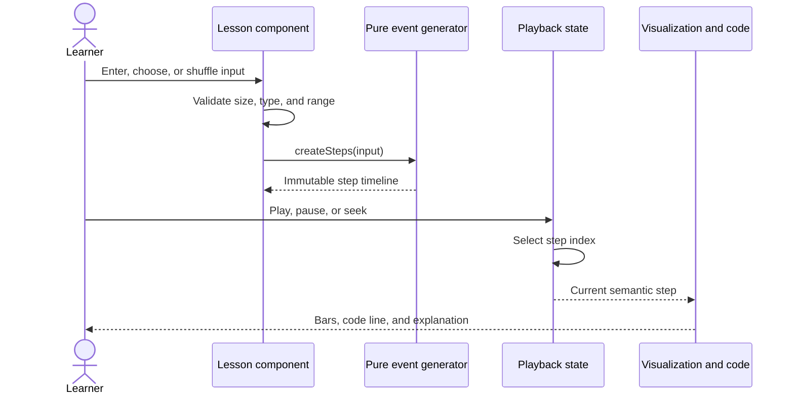
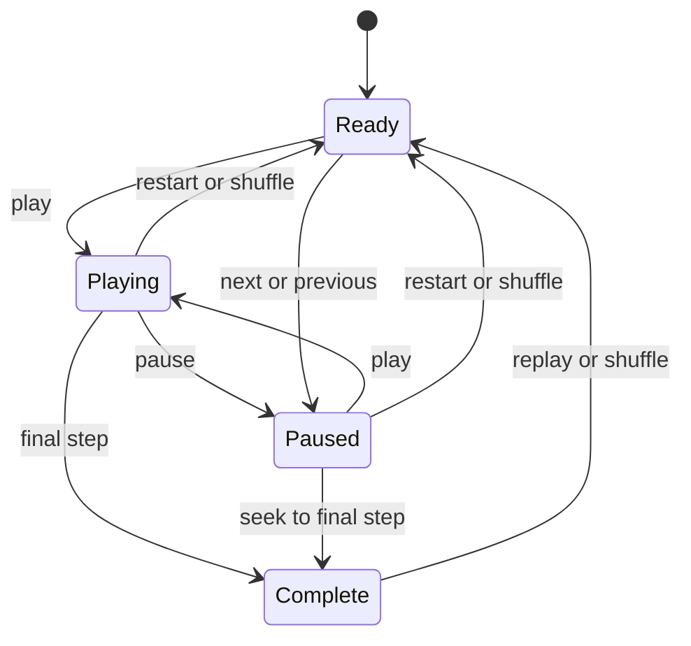

# Cartesian Architecture

This document explains the current runtime design, the boundaries that should remain stable, and the decisions intentionally deferred while the application grows beyond its first sorting lesson family.

## System goal

Cartesian turns algorithm execution into a timeline a learner can inspect. Each state must support:

- Deterministic replay
- Forward and backward stepping
- Synchronized visualization, code, and explanation
- Playback at different speeds
- Unit testing without rendering React

## Runtime flow



The arrows show ownership: the lesson owns the input, the algorithm owns event creation, the player owns time, and the view owns presentation.

## Responsibility boundaries

### Algorithm event generator

Locations: `src/features/sorting/bubbleSort.ts`, `src/features/sorting/selectionSort.ts`, and `src/features/sorting/insertionSort.ts`

Responsibilities:

- Accept plain input data
- Avoid mutating caller-owned values
- Execute the real algorithm
- Record meaningful semantic snapshots
- Return deterministic output

It must not import React, access the DOM, start timers, or choose colors.

### Shared sorting lesson player

Location: `src/features/sorting/SortLesson.tsx`

Responsibilities:

- Own the selected input and timeline cursor
- Schedule automatic playback
- Convert learner actions into cursor changes
- Render semantic event state
- Keep visualization, pseudocode, and narration synchronized

Bubble Sort, Selection Sort, and Insertion Sort provide typed lesson definitions and pure event generators to the shared player. The extraction happened only after Selection Sort demonstrated the common API: playback state, semantic bars, pseudocode highlighting, narration, speed controls, and lesson navigation.

The algorithm-specific wrapper components contain educational content rather than playback mechanics. This keeps lesson configuration explicit while preventing duplicated visualization code.

### Custom array input

Locations: `src/features/sorting/ArrayInputControls.tsx` and `src/features/sorting/arrayInput.ts`

The control owns temporary form state; the lesson owns the accepted array. A pure parser converts comma- or whitespace-separated text into normalized numeric values before the lesson can replace its timeline input.

The parser accepts 2–8 whole numbers from 1–99 and preserves duplicates. These are product constraints rather than algorithm constraints: positive values keep bar geometry and labels meaningful, while eight bars remain readable at the smallest supported viewport. Invalid text never reaches an event generator. Applying valid values pauses playback and returns the cursor to the initial event; shuffling preserves the chosen array length.

### Prediction checkpoint

Location: `src/features/learning/PredictionCheckpoint.tsx`

Responsibilities:

- Render an algorithm-specific reasoning question
- Allow repeated attempts after an incorrect answer
- Reveal a targeted hint without exposing the correct option
- Lock options and explain the invariant after a correct answer
- Reset independently from algorithm playback

Checkpoint definitions live beside lesson content. They do not inspect timeline events or duplicate algorithm execution. This keeps the question pedagogically intentional and allows the component to be reused by future trees, graphs, and problem-solving lessons.

### Application shell

Location: `src/App.tsx`

Responsibilities:

- Render the handbook identity and learning path
- Own global chapter-menu state
- Select a typed application route
- Synchronize home, catalogue, lesson, and not-found screens with browser history
- Update document titles and move focus after client-side navigation

Route parsing and serialization live in `src/features/catalog/routing.ts`. The application uses a discriminated union rather than arbitrary route strings, so only catalogue-validated lesson slugs can reach lesson rendering or progress persistence. Existing `#bubble-sort`-style links remain valid, while `#arrays` addresses the chapter catalogue and unknown hashes render an explicit recovery screen.

The typed curriculum registry in `src/features/catalog/curriculum.tsx` is the source for lesson routes, switcher labels, chapter counts, progress validation, catalogue cards, and component selection. Educational definitions remain in the sorting feature rather than moving into the routing layer.

## Event design

Events describe algorithm meaning rather than animation instructions.

Good event fields:

- `compared: [left, right]`
- `swapped: [left, right]`
- `sortedIndices: number[]`
- `line: number`

Avoid fields such as:

- `moveBarLeftBy: 76`
- `flashColor: "#ff655c"`
- `waitMilliseconds: 400`

The first group survives a redesign. The second couples algorithm correctness to a particular layout and animation speed.

## State model



The visualization does not own a separate copy of algorithm state. It derives everything from the current timeline step, which prevents code highlighting and visible values from drifting apart.

## Testing boundaries

Unit tests cover event generators, custom-input parsing, and persistence because they contain correctness-sensitive transformations. Component tests cover prediction interaction and custom-array form behavior. The next useful test layers are:

1. Shared player interaction tests for button and timer behavior.
2. Browser-level focus and accessible-state tests.
3. One end-to-end catalogue-to-completion flow in a real browser.

Snapshot-testing the entire page is deliberately avoided. Large markup snapshots are noisy and do not prove that algorithm states are correct.

## Progress persistence

Progress is stored under the versioned key `cartesian.learning-progress.v1`. The payload intentionally contains only source-of-truth identifiers:

```ts
type LearningProgress = {
  version: 1
  completedLessonSlugs: string[]
  lastLessonSlug: string | null
}
```

Chapter percentages, completion counts, resume labels, and navigation badges are derived at render time. They are not persisted, because derived values would become stale when lessons are added or removed.

The loader validates the schema, removes duplicate and unknown slugs, and falls back to empty progress for malformed JSON, unsupported versions, or unavailable browser storage. The application continues to function when persistence fails.

Current trade-offs:

- Progress belongs to one browser profile and does not synchronize across devices.
- Clearing site data removes progress.
- No personal data or algorithm input values are stored.
- A future account system can replace the storage adapter without changing the lesson event model.

## Accessibility

Current foundations:

- Semantic buttons for every interactive control
- Descriptive labels for icon-only buttons
- Live narration region for step changes
- Keyboard playback bindings for play/pause, stepping, restart, and speed
- Protection for native browser shortcuts and focused interactive elements
- Labeled custom-array field with described constraints and live validation errors
- Visible shortcut reference in every sorting lesson
- Live prediction feedback with retryable answers
- Disabled answer state only after a correct response
- Reduced-motion media query
- Responsive layouts that preserve content order

Known gaps:

- Bar-state changes need richer screen-reader descriptions.
- Focus should move predictably when navigating between lessons.
- Color states should gain shape or label redundancy in the visualization itself.

## Performance

The current timelines are intentionally precomputed. For small teaching inputs, this makes seeking and replay simple while memory use remains negligible.

For algorithms that generate very large traces, possible strategies include input-size limits, event compression, checkpoints, or lazy generation. None is currently justified by the input limit of eight educational values.

## Delivery pipeline

The GitHub Actions workflow has two responsibility boundaries:

1. The quality job installs the lockfile exactly, then runs tests, static analysis, and the production build.
2. The deployment job runs only for a verified `main` build and receives the `pages: write` and OpenID Connect permissions required by GitHub Pages.

Pull requests run the same quality gate but cannot upload or deploy the site. Actions are pinned to full commit SHAs to reduce the risk of a mutable third-party tag changing the pipeline unexpectedly. Vite prefixes production assets with `/cartesian-interactive-algorithms/`; local development stays at `/`.

## Deferred decisions

- **Global state library:** local state is sufficient today.
- **Animation library:** CSS transitions cover the current choreography.
- **Backend:** progress can begin in local storage.
- **Content management:** typed local lesson modules are simpler at the current scale.
- **Routing library:** the typed hash layer supports the current flat catalogue and works without server fallback configuration on GitHub Pages. A dependency becomes justified for nested layouts, route loaders, or URL parameters.

These are deliberate deferrals, not missing architecture. Each should be revisited when a concrete feature makes the current solution painful.
